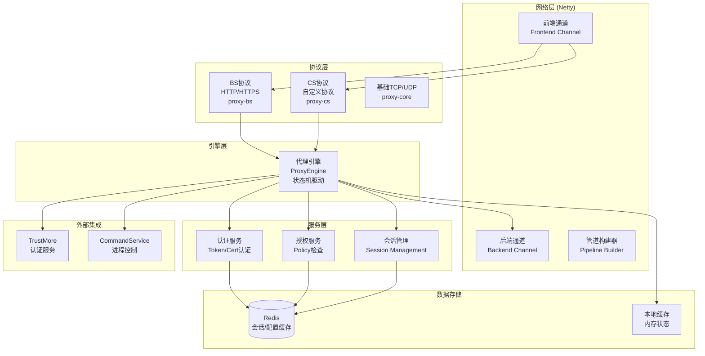
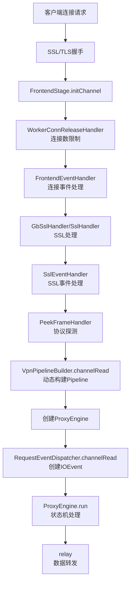
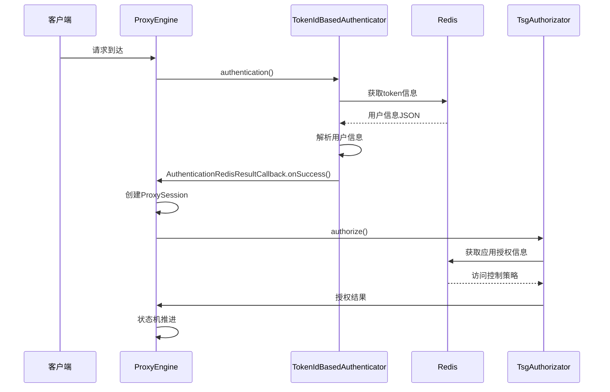
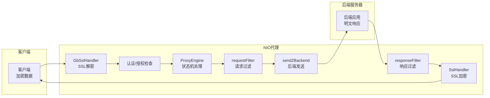

# NIO 项目架构设计文档

> **生成日期**: 2026-05-11  
> **分析范围**: NIO/ 源码、相关文档和配置文件  
> **分析方式**: 静态代码分析、文档整合  
> **文档生成**: GitHub Copilot

## 1. 项目概述

NIO 是一个基于 Netty 的高性能、非阻塞 I/O 代理引擎系统，主要提供：

- **SSL VPN 代理**: 支持 SSL/TLS 卸载和双向认证
- **协议转发**: HTTP/HTTPS 反向代理和自定义协议转发
- **认证集成**: 与 TrustMore 认证服务的集成
- **会话管理**: Redis 同步和本地会话管理
- **视频流代理**: RTSP/RTP 流媒体转发

系统采用事件驱动的分层架构，核心基于 Netty NIO 框架，实现高并发、低延迟的代理服务。

## 2. 总体架构



## 3. 技术栈

| 组件 | 技术选型 | 版本/说明 |
|------|----------|-----------|
| **网络框架** | Netty | 4.1.11.Final，高性能NIO |
| **构建工具** | Apache Ant | 多模块构建 |
| **运行环境** | JDK | 独立Java进程 |
| **缓存/消息** | Jedis/Redis | 会话同步、配置缓存 |
| **序列化** | FastJSON | JSON数据处理 |
| **日志** | Log4j | 系统日志记录 |
| **SSL/TLS** | JDK SSL | 证书验证和加密 |

## 4. 核心模块设计

### 4.1 模块结构

```
NIO/
├── launcher/              # 启动器模块
│   ├── src/               # 启动逻辑
│   └── build.xml          # 构建配置
├── proxy-api/             # 公共API模块
│   ├── src/               # 接口定义
│   └── build.xml
├── proxy-app/             # 应用主模块
│   ├── src/               # 应用入口
│   └── build.xml
├── proxy-bs/              # BS协议处理
│   ├── src/               # HTTP/HTTPS处理
│   └── build.xml
├── proxy-cs/              # CS协议处理
│   ├── src/               # 自定义协议处理
│   └── build.xml
├── proxy-core/            # 核心引擎模块
│   ├── src/               # 代理引擎核心
│   └── build.xml
├── proxy-interface/       # 接口定义模块
│   ├── src/               # 服务接口
│   └── build.xml
├── server-lib/            # 服务端库
│   └── lib/               # 第三方依赖
├── util/                  # 工具类模块
│   ├── src/               # 公共工具
│   └── build.xml
```

### 4.2 模块职责

#### proxy-core (核心引擎)
- **ProxyEngine**: 状态机驱动的代理引擎
  - REQUEST_RECEIVED → AUTHENTICATING → AUTHORIZATING → BACKEND_CONNECTING → PROXY_RELAY
- **EngineStatus**: 引擎状态管理
- **IIoModel**: IO模型接口定义

#### proxy-bs (HTTP/HTTPS协议)
- **BsRequest**: HTTP请求处理
- **HttpRequestHandler**: HTTP请求处理器
- **反向代理**: HTTP/HTTPS流量转发

#### proxy-cs (自定义协议)
- **CsRequest**: 自定义协议请求
- **CsParser**: 协议解析器
- **TCP/UDP处理**: 自定义协议转发

#### proxy-api (公共接口)
- **IProxyRequest**: 代理请求接口
- **IAuthenticator**: 认证接口
- **IAuthorization**: 授权接口

#### proxy-app (应用入口)
- **ProxyServer**: 代理服务器主类
- **ProxyLauncher**: 启动器
- **FrontendStage**: 前端通道初始化

#### launcher (启动器)
- **ProxyLauncher**: 系统启动入口
- **ClassPathUtil**: 类路径工具

#### util (工具类)
- **XmlUtil**: XML处理工具
- **ByteUtil**: 字节操作工具
- **Compress**: 压缩工具
- **LimitLatch**: 连接限制器

## 5. 执行流程

### 5.1 请求处理主流程



### 5.2 认证授权流程



## 6. 数据流设计

### 6.1 数据转发流程



### 6.2 Redis数据流

- **会话数据**: `token_{tokenId}` 存储用户信息
- **配置数据**: 应用策略、访问控制规则
- **通知机制**: `engineChangeChannel` 发布配置变更
- **服务中心**: `service_info` 订阅服务状态

## 7. 部署架构

### 7.1 部署模式

```
┌─────────────────────────────────────────────────────────────┐
│                    客户端层                                  │
│  ┌─────────────┐  ┌─────────────┐  ┌─────────────┐         │
│  │   浏览器    │  │  桌面应用   │  │   移动端    │         │
│  └─────────────┘  └─────────────┘  └─────────────┘         │
└─────────────────────┬───────────────────────────────────────┘
                      │ SSL/TLS
┌─────────────────────▼───────────────────────────────────────┐
│                   NIO代理层                                  │
│  ┌─────────────┐  ┌─────────────┐  ┌─────────────┐         │
│  │   NIO-1     │  │   NIO-2     │  │   NIO-3     │         │
│  │   Engine    │  │   Engine    │  │   Engine    │         │
│  └─────────────┘  └─────────────┘  └─────────────┘         │
└─────────────────────┬───────────────────────────────────────┘
                      │
┌─────────────────────▼───────────────────────────────────────┘
│                   后端服务层                                 │
│  ┌─────────────┐  ┌─────────────┐  ┌─────────────┐         │
│  │  Web应用    │  │   API服务   │  │  数据库     │         │
│  └─────────────┘  └─────────────┘  └─────────────┘         │
└─────────────────────────────────────────────────────────────┘
```

### 7.2 高可用设计

- **负载均衡**: 多NIO实例通过负载均衡器分发请求
- **配置同步**: Redis保证配置一致性
- **故障转移**: 实例故障时自动切换
- **监控**: 集成TrustMore的监控体系

## 8. 性能优化

### 8.1 性能特性

- **并发处理**: 基于Netty的事件驱动，支持高并发
- **内存管理**: 零拷贝技术，减少内存拷贝
- **连接池**: 后端连接复用
- **缓存策略**: Redis缓存热点配置和会话

### 8.2 监控指标

- **连接数**: 当前活跃连接数
- **吞吐量**: 请求/响应速率
- **延迟**: 请求处理时间
- **错误率**: 连接失败、认证失败率

## 9. 安全设计

### 9.1 SSL/TLS处理

- **双向认证**: 客户端和服务器证书验证
- **证书管理**: 与TrustMore证书服务集成
- **加密传输**: 全链路SSL加密

### 9.2 访问控制

- **Token验证**: 基于Redis的token认证
- **策略检查**: 应用级和资源级权限控制
- **审计记录**: 所有访问记录到SysLog

## 10. 扩展性设计

### 10.1 协议扩展

- **自定义协议**: 通过proxy-cs模块支持新协议
- **插件机制**: 动态加载协议处理器
- **配置驱动**: 协议配置外部化

### 10.2 功能扩展

- **认证扩展**: 支持多种认证方式
- **过滤器扩展**: 请求/响应过滤器链
- **监控扩展**: 可插拔监控指标

## 11. 运维设计

### 11.1 配置管理

- **启动配置**: JVM参数、端口配置
- **运行配置**: Redis连接、证书路径
- **热重载**: 支持部分配置动态更新

### 11.2 日志管理

- **应用日志**: Netty事件、处理流程
- **错误日志**: 异常信息和堆栈
- **审计日志**: 安全相关事件

## 12. 风险评估与改进建议

### 12.1 架构风险

| 风险等级 | 风险点 | 影响 | 建议措施 |
|----------|--------|------|----------|
| 高 | Netty版本依赖 | 安全漏洞风险 | 定期升级Netty版本 |
| 中 | 单点Redis依赖 | 缓存不可用 | Redis集群部署 |
| 中 | 状态机复杂度 | 调试困难 | 状态机可视化工具 |
| 低 | 内存泄漏 | 长期运行稳定性 | 内存监控和泄漏检测 |

### 12.2 技术债务

- **测试覆盖**: 缺少集成测试
- **文档更新**: 代码变更文档同步
- **性能基准**: 缺少性能基准测试
- **错误处理**: 异常处理不够完善

### 12.3 演进建议

1. **短期 (3-6个月)**:
   - 完善单元测试和集成测试
   - 引入性能监控和基准测试
   - 优化错误处理和日志记录

2. **中期 (6-12个月)**:
   - 升级Netty到最新稳定版本
   - 实现Redis集群支持
   - 开发状态机调试工具

3. **长期 (1-2年)**:
   - 容器化部署支持
   - 微服务化拆分
   - 云原生架构适配

## 13. 总结

NIO项目是一个高性能的代理引擎系统，基于Netty构建，采用事件驱动和状态机设计。系统具有良好的模块化架构，支持多种协议转发和认证集成。在性能、安全和扩展性方面具有优势，但在测试覆盖和文档维护方面需要加强。

未来发展应重点关注测试完善、性能优化和云原生转型，以适应现代分布式系统的需求。</content>
<parameter name="filePath">/home/tiandb/Dev/SVN/6.4.2/NIO架构设计copilot.md