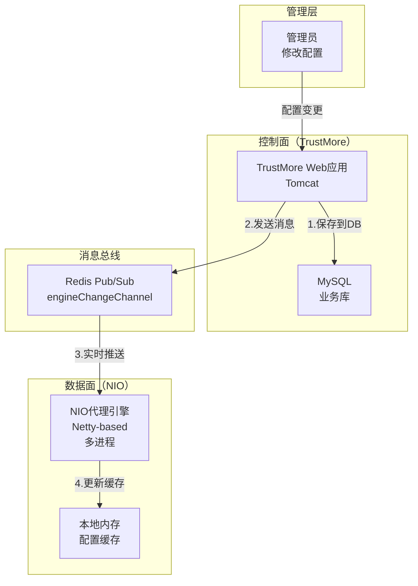
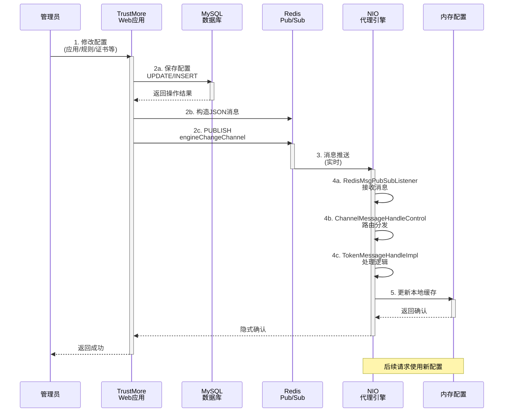
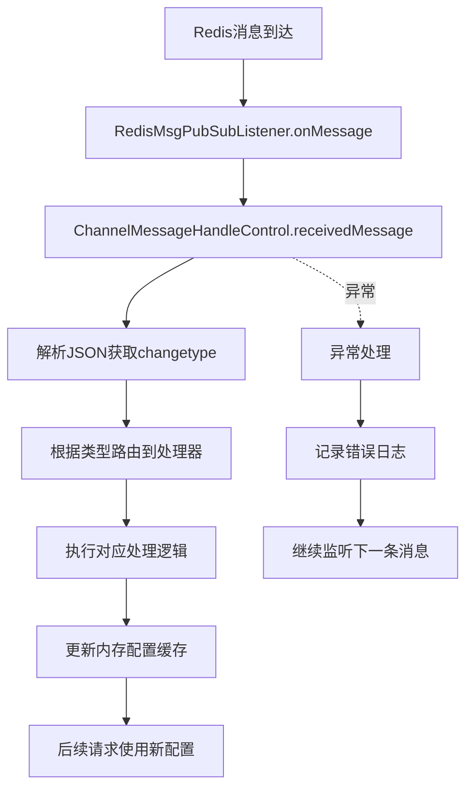
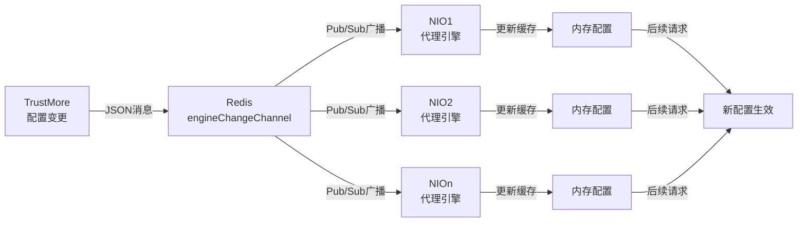

# TrustMore → NIO 配置同步机制详解

> **文档类型**: 架构设计与集成说明  
> **生成日期**: 2026-05-12  
> **适用版本**: 6.4.2  
> **涉及模块**: TrustMore (控制面) + NIO (数据面) + Redis (消息总线)

---

## 一、系统总体架构

### 1.1 三层结构



---

## 二、配置变化传递流程

### 2.1 完整时序图



### 2.2 各阶段时间成本

| 阶段 | 处理组件 | 耗时 | 说明 |
|------|---------|------|------|
| **1** | Admin → TrustMore | ~100ms | HTTP请求往返 |
| **2a** | 保存DB | ~50-200ms | 同步INSERT/UPDATE |
| **2b-2c** | TrustMore → Redis | ~10-20ms | 本地Jedis连接 |
| **3** | Redis广播 | ~5-10ms | Redis Pub/Sub |
| **4a-4c** | 消息处理 | ~20-50ms | NIO侧处理逻辑 |
| **5** | 更新缓存 | ~1-10ms | 内存操作 |
| **总计** | 端到端 | **~200-400ms** | 配置秒级生效 |

---

## 三、代码实现细节

### 3.1 TrustMore发送端

#### 3.1.1 配置变更触发点

**位置**: `TrustMore/src/cn/com/tsg/user/action/ApiAction.java`

```java
// 用户权限变更时发送配置更新
public void updateUserPermission(User user, List<CsApp> apps) {
    try {
        // 1. 保存到数据库
        userJdbc.updateUser(user);
        appJdbc.updateApps(apps);
        
        // 2. 构造Redis消息
        JSONObject message = new JSONObject();
        message.put("changetype", "TOKEN_DEL");        // 变更类型
        message.put("serviceId", extractServiceIds(apps)); // 应用ID列表
        message.put("timestamp", System.currentTimeMillis());
        message.put("userId", user.getId());
        
        // 3. 发送到Redis
        JedisConn.getPublishInstance().publish(
            message.toString(),              // 消息体
            "engineChangeChannel"            // 频道名称
        );
        
        logger.info("发送配置变更消息: " + message.toString());
        
    } catch (Exception e) {
        logger.error("配置变更失败", e);
    }
}
```

#### 3.1.2 消息发送示例

```java
// 场景1: 用户认证信息变更
public void sendTokenUpdate(String tokenId, User user) {
    JSONObject msg = new JSONObject();
    msg.put("changetype", "TOKEN_DEL");
    msg.put("token_id", tokenId);
    msg.put("action", "update");
    JedisConn.getPublishInstance().publish(msg.toString(), "engineChangeChannel");
}

// 场景2: 应用配置变更
public void sendAppConfigUpdate(int appId, AppConfig config) {
    JSONObject msg = new JSONObject();
    msg.put("changetype", "APP_CONFIG_CHANGE");
    msg.put("app_id", appId);
    msg.put("config", JSONObject.fromObject(config));
    JedisConn.getPublishInstance().publish(msg.toString(), "engineChangeChannel");
}

// 场景3: 访问策略变更
public void sendPolicyUpdate(Policy policy) {
    JSONObject msg = new JSONObject();
    msg.put("changetype", "POLICY_UPDATE");
    msg.put("policy_id", policy.getId());
    msg.put("policy_data", JSONObject.fromObject(policy));
    JedisConn.getPublishInstance().publish(msg.toString(), "engineChangeChannel");
}
```

---

### 3.2 NIO接收端

#### 3.2.1 初始化阶段

**位置**: `NIO/proxy-app/src/cn/com/tsg/proxy/app/RemoteStartProxyApp.java`

```java
public class RemoteStartProxyApp {
    
    public static void main(String[] args) throws Exception {
        // ... 其他初始化代码 ...
        
        // 启动Redis监听通道（关键）
        RedisHandleUtils.getInstance().initRedisChannel();
        
        logger.info("====NIO代理引擎启动完成=======");
    }
}
```

**步骤1：初始化Redis监听**

```java
// RedisHandleUtils.java
public class RedisHandleUtils {
    
    public void initRedisChannel() {
        Thread redisChannel = new Thread(new Runnable() {
            public void run() {
                try {
                    // 在独立线程中订阅Redis频道
                    RedisSubscribe.subChannel();
                    logger.info("====redis启动监听通道完成=======");
                } catch (Exception e) {
                    logger.error("Redis监听启动失败", e);
                }
            }
        });
        
        // 设置为守护线程，NIO关闭时自动关闭
        redisChannel.setDaemon(false);
        redisChannel.setName("RedisChannelListener-Thread");
        redisChannel.start();
        
        logger.info("====redis启动监听通道线程=======");
    }
}
```

**步骤2：订阅Redis频道**

```java
// RedisSubscribe.java
public class RedisSubscribe {
    
    private static Logger logger = LogManager.getLogger("system_logger");
    
    public static final String ip = "127.0.0.1";
    public static final int port = 6379;
    public static final int timeOut = 0;
    public static final String password = "ZyRedis";
    public static final String CHANNEL_NAME = "engineChangeChannel";
    
    public static void subChannel() {
        JedisPool jedisPool = null;
        Jedis subscriberJedis = null;
        
        try {
            // 创建Jedis连接池
            JedisPoolConfig poolConfig = new JedisPoolConfig();
            poolConfig.setMaxTotal(1);           // 只需要1个连接用于订阅
            poolConfig.setMaxIdle(1);
            
            jedisPool = new JedisPool(
                poolConfig, 
                ip, 
                port, 
                timeOut, 
                password
            );
            
            // 获取订阅专用连接
            subscriberJedis = jedisPool.getResource();
            
            // 订阅频道（阻塞式）
            logger.info("开始订阅Redis频道: " + CHANNEL_NAME);
            subscriberJedis.subscribe(
                new RedisMsgPubSubListener(),  // 监听器
                CHANNEL_NAME                   // 频道名
            );
            
        } catch (Exception e) {
            logger.error("Redis订阅异常: " + e.getMessage(), e);
        } finally {
            if (jedisPool != null) {
                jedisPool.returnResource(subscriberJedis);
                jedisPool.destroy();
            }
        }
    }
}
```

#### 3.2.2 消息接收与处理

**步骤3：消息监听器**

```java
// RedisMsgPubSubListener.java
public class RedisMsgPubSubListener extends JedisPubSub {
    
    private static Logger logger = LogManager.getLogger("system_logger");
    
    /**
     * 接收发布的消息
     * 此方法在Redis发送消息时立即被调用
     */
    @Override
    public void onMessage(String channel, String message) {
        logger.info("收到Redis消息");
        logger.info("  频道: " + channel);
        logger.info("  消息: " + message);
        
        // 判断频道是否为目标频道
        if (channel.equals(RedisChannelEnum.ENGINE_CHANGE_CHANNEL.getName())) {
            // 根据消息类型分发处理
            ChannelMessageHandleControl.getInstance()
                .receivedMessage(message);
        } else {
            logger.warn("未知频道消息: channel=" + channel + ", message=" + message);
        }
    }
    
    @Override
    public void onSubscribe(String channel, int subscribedChannels) {
        logger.info("成功订阅频道: " + channel + 
                   " (当前订阅数: " + subscribedChannels + ")");
    }
    
    @Override
    public void onUnsubscribe(String channel, int subscribedChannels) {
        logger.warn("取消订阅频道: " + channel);
    }
    
    @Override
    public void onPMessage(String pattern, String channel, String message) {
        // 模式订阅回调（当前未使用）
    }
    
    @Override
    public void onPSubscribe(String pattern, int subscribedChannels) {
        // 模式订阅回调（当前未使用）
    }
    
    @Override
    public void onPUnsubscribe(String pattern, int subscribedChannels) {
        // 模式取消订阅回调（当前未使用）
    }
}
```

**步骤4：消息分发控制器**

```java
// ChannelMessageHandleControl.java
public class ChannelMessageHandleControl {
    
    private static Logger logger = LogManager.getLogger("system_logger");
    
    // 消息处理器实现类映射表
    private static Map<String, Class> channelMessageHandleImplMap;
    
    static {
        channelMessageHandleImplMap = new HashMap<>();
        // TOKEN_DEL: 删除用户Token，触发重新认证
        channelMessageHandleImplMap.put(
            RedisSendTypeEnum.TOKEN_DEL.getName(), 
            TokenMessageHandleImpl.class
        );
        // 可以扩展其他消息类型
        // channelMessageHandleImplMap.put("APP_CONFIG_CHANGE", AppConfigHandleImpl.class);
        // channelMessageHandleImplMap.put("POLICY_UPDATE", PolicyHandleImpl.class);
    }
    
    private static ChannelMessageHandleControl instance;
    
    public static ChannelMessageHandleControl getInstance() {
        if (instance == null) {
            synchronized (ChannelMessageHandleControl.class) {
                if (instance == null) {
                    instance = new ChannelMessageHandleControl();
                }
            }
        }
        return instance;
    }
    
    /**
     * 接收并处理Redis通道消息
     * 
     * @param message JSON格式的消息字符串
     *                示例: {"changetype":"TOKEN_DEL","serviceId":[1,2,3]}
     */
    public void receivedMessage(String message) {
        try {
            logger.info("处理Redis通道消息: " + message);
            
            // 1. 解析JSON消息
            JSONObject jsonObject = JSONObject.fromObject(message);
            
            if (jsonObject == null) {
                logger.error("消息解析失败: JSON为null");
                return;
            }
            
            // 2. 提取变更类型
            String changetype = (String) jsonObject.get(
                RedisChannelEnum.CHANGE_TYPE.getName()
            );
            
            if (changetype == null) {
                logger.error("消息格式错误: 缺少changetype字段");
                return;
            }
            
            logger.info("消息类型: " + changetype);
            
            // 3. 获取对应的处理实现类
            MessageHandle handler = getChannelMessageHandleImpl(changetype);
            
            if (handler == null) {
                logger.error("未找到处理器: changetype=" + changetype);
                return;
            }
            
            // 4. 调用处理器处理消息
            handler.channelMessageHandle(jsonObject);
            
            logger.info("消息处理完成: " + changetype);
            
        } catch (Exception e) {
            logger.error("处理Redis通道消息异常", e);
        }
    }
    
    /**
     * 根据消息类型获取对应的处理器实现类
     */
    private MessageHandle getChannelMessageHandleImpl(String typeName) 
            throws Exception {
        
        Class handlerClass = null;
        
        // 使用contains而非equals，支持子类型匹配
        if (typeName.contains(RedisSendTypeEnum.TOKEN_DEL.getName())) {
            handlerClass = channelMessageHandleImplMap.get(
                RedisSendTypeEnum.TOKEN_DEL.getName()
            );
        }
        
        MessageHandle handler = null;
        if (handlerClass != null) {
            // 反射创建处理器实例
            handler = (MessageHandle) handlerClass.newInstance();
        }
        
        return handler;
    }
}
```

**步骤5：具体消息处理器**

```java
// TokenMessageHandleImpl.java - Token删除处理
public class TokenMessageHandleImpl implements MessageHandle {
    
    private static Logger logger = LogManager.getLogger("system_logger");
    
    /**
     * 处理通道消息（配置下发）
     * 清除指定用户的Token，强制重新认证
     */
    @Override
    public void channelMessageHandle(JSONObject jsonObject) {
        try {
            logger.info("处理TOKEN_DEL消息");
            
            // 解析消息内容
            String tokenId = (String) jsonObject.get("token_id");
            List<?> serviceIds = (List<?>) jsonObject.get("serviceId");
            long timestamp = (long) jsonObject.get("timestamp");
            
            logger.info("删除Token - tokenId: " + tokenId + 
                       ", serviceIds: " + serviceIds);
            
            // 执行核心逻辑：删除Session
            if (tokenId != null) {
                // 从内存Session池中删除
                SessionList.getInstance().removeSession(tokenId);
                
                // 从Redis中删除Token信息
                JedisConn.getPublishInstance().del("token_" + tokenId);
                
                logger.info("Token已删除，用户需要重新认证");
            }
            
            if (serviceIds != null && !serviceIds.isEmpty()) {
                // 针对特定应用的处理
                for (Object serviceIdObj : serviceIds) {
                    int serviceId = ((Number) serviceIdObj).intValue();
                    // 更新该应用的相关缓存
                    updateAppCache(serviceId);
                }
            }
            
            logger.info("TOKEN_DEL处理完成");
            
        } catch (Exception e) {
            logger.error("处理TOKEN_DEL消息异常", e);
        }
    }
    
    /**
     * 处理Redis直接存储的消息
     */
    @Override
    public void redisMessageHandle(JSONObject jsonObject) {
        // 实现具体逻辑
    }
    
    /**
     * 更新应用缓存
     */
    private void updateAppCache(int serviceId) {
        try {
            // 从Redis获取最新的应用配置
            String appConfigKey = "app_config_" + serviceId;
            String configJson = JedisConn.getPublishInstance()
                .getMessage(appConfigKey);
            
            if (configJson != null) {
                // 解析并更新本地缓存
                AppConfig config = JSONObject.toBean(
                    JSONObject.fromObject(configJson), 
                    AppConfig.class
                );
                
                // 更新内存中的应用配置
                AppConfigCache.getInstance().updateConfig(serviceId, config);
                
                logger.info("应用配置已更新: appId=" + serviceId);
            }
        } catch (Exception e) {
            logger.error("更新应用缓存异常: appId=" + serviceId, e);
        }
    }
}
```

---

## 四、消息格式规范

### 4.1 核心消息字段

```json
{
    "changetype": "TOKEN_DEL",                    // [必须] 变更类型
    "token_id": "abc123",                         // [可选] Token ID
    "serviceId": [1, 2, 3],                       // [可选] 服务/应用ID列表
    "timestamp": 1715425200000,                   // [必须] 消息生成时间戳
    "userId": 100,                                // [可选] 用户ID
    "operatorId": 50,                             // [可选] 操作者ID
    "reason": "user_permission_changed",          // [可选] 变更原因
    "data": {                                     // [可选] 扩展数据
        "old_value": "...",
        "new_value": "..."
    }
}
```

### 4.2 支持的变更类型

| changetype | 触发条件 | 处理器 | 说明 |
|-----------|---------|------|------|
| `TOKEN_DEL` | 删除用户Token | `TokenMessageHandleImpl` | 用户权限变更，强制重新认证 |
| `APP_CONFIG_CHANGE` | 应用配置变更 | `AppConfigHandleImpl` | 应用策略更新，NIO刷新配置 |
| `POLICY_UPDATE` | 访问策略变更 | `PolicyHandleImpl` | 代理规则更新 |
| `CERT_UPDATE` | 证书变更 | `CertHandleImpl` | SSL证书更新，重新加载 |
| `IP_WHITELIST_CHANGE` | IP白名单变更 | `IpWhitelistHandleImpl` | 访问控制策略变更 |

### 4.3 消息示例

**示例1：用户认证信息变更**
```json
{
    "changetype": "TOKEN_DEL",
    "token_id": "user_token_xyz123",
    "userId": 1001,
    "timestamp": 1715425200000,
    "reason": "password_changed"
}
```

**示例2：应用配置变更**
```json
{
    "changetype": "APP_CONFIG_CHANGE",
    "serviceId": [10, 11],
    "timestamp": 1715425200000,
    "data": {
        "proxy_mode": "reverse_proxy",
        "ssl_version": "TLSv1.2",
        "cipher_suite": "TLS_RSA_WITH_AES_256_CBC_SHA"
    }
}
```

**示例3：批量应用更新**
```json
{
    "changetype": "POLICY_UPDATE",
    "serviceId": [1, 2, 3, 4, 5],
    "timestamp": 1715425200000,
    "operatorId": 100,
    "data": {
        "policy_name": "visitor_access",
        "allow_services": [1, 2, 3]
    }
}
```

---

## 五、关键配置项

### 5.1 NIO中Redis相关的配置常量

```java
// RedisHandleUtils.java
public class RedisHandleUtils {
    
    // ========== 配置下发相关的Redis Key ==========
    
    // 所有应用的ID索引
    public static final String SERVER_INDEX_REDISKEY = "serviceindex";
    
    // 证书透传相关
    public static final String CERT_PASSTHROUGH_REDISKEY = "cert_passthrough";
    
    // 访问模式（单向/双向认证）
    public static final String ACCESS_MODE_REDISKEY = "accessMode";
    
    // 引擎策略配置
    public static final String SET_PROPERTY_REDISKEY = "proxy_config_setProperty";
    
    // 协议配置
    public static final String ADD_PROTOCOL_REDISKEY = "proxy_config_addProtocol";
    
    // 报文审计启用状态
    public static final String MESSAGE_AUDIT_STATUS_REDISKEY = 
        "control_message_audit_status";
    
    // 报文审计端口号
    public static final String MESSAGE_AUDIT_AGREEMENT_PORT_REDISKEY = 
        "control_message_audit_agreementport";
    
    // 用户绑定IP
    public static final String FGF_USER_BIND_IP_REDISKEY = 
        "proxy_service_fgfuser_bind_ip";
    
    // 放管服缺省IP地址
    public static final String FGF_DEFAULT_IP_ADDRESS_REDISKEY = 
        "proxy_service_fgfdefaultip_address";
    
    // 访问地址控制
    public static final String ADDRESS_SOURCE_REDISKEY = 
        "proxy_service_address_source";
    
    // 代理IP绑定
    public static final String PROXY_IP_BIND_REDISKEY = 
        "proxy_service_proxyip_bind";
    
    // 配置变更通知频道
    public static final String CHANNEL_NAME = "engineChangeChannel";
    
    // 配置Key列表（初始化时遍历）
    public static final String[] REDIS_KEY_LIST = {
        SET_PROPERTY_REDISKEY,
        ADD_PROTOCOL_REDISKEY,
        ACCESS_MODE_REDISKEY,
        CERT_PASSTHROUGH_REDISKEY,
        MESSAGE_AUDIT_STATUS_REDISKEY,
        MESSAGE_AUDIT_AGREEMENT_PORT_REDISKEY,
        FGF_USER_BIND_IP_REDISKEY,
        FGF_DEFAULT_IP_ADDRESS_REDISKEY,
        ADDRESS_SOURCE_REDISKEY,
        PROXY_IP_BIND_REDISKEY
    };
}
```

### 5.2 Redis连接配置

**TrustMore侧** - `cn.com.tsg.admin.redis.jdbc.JedisConn`

```properties
# Redis服务器配置
redis.ip=127.0.0.1
redis.port=6379
redis.timeout=0
redis.password=<AES_ENCRYPTED>  # 密码经过AES加密存储

# 连接池配置
redis.pool.maxTotal=20
redis.pool.maxIdle=10
redis.pool.testOnBorrow=true
redis.pool.testOnReturn=true
```

**NIO侧** - `cn.com.tsg.redis.newhandle.RedisSubscribe`

```java
public static final String ip = "127.0.0.1";
public static final int port = 6379;
public static final int timeOut = 0;
public static final String password = "ZyRedis";
public static final String CHANNEL_NAME = "engineChangeChannel";
```

---

## 六、完整交互流程

### 6.1 配置更新的三种触发方式

#### 方式1：用户操作触发（最常见）

```
管理员 → 浏览器 → TrustMore WebUI
  ↓
操作路径: /admin/user/updatePermission.do
  ↓
UserAction.updateUserPermission()
  ↓
1. userJdbc.updateUser(user)         // 保存到MySQL
2. JedisConn.publish(message, "engineChangeChannel")  // 发送Redis消息
  ↓
消息立即推送到所有订阅的NIO实例
```

#### 方式2：API调用触发

```
外部系统 → TrustMore API
  ↓
POST /api/updateAppConfig.do
  ↓
ApiAction.updateAppConfig()
  ↓
构造消息 → 发布到Redis
  ↓
NIO接收处理
```

#### 方式3：定时任务触发（不常见）

```
Quartz定时任务
  ↓
每隔N分钟扫描数据库变更
  ↓
检测到变更 → 构造消息 → 发布到Redis
  ↓
NIO接收处理
```

### 6.2 配置应用流程



---

## 七、错误处理与容错机制

### 7.1 常见故障场景

| 故障场景 | 现象 | 处理方案 |
|---------|------|---------|
| Redis连接断开 | NIO无法接收消息 | 自动重连机制 + 重启监听线程 |
| 消息格式错误 | 解析异常 | 捕获异常，记录日志，继续监听 |
| 消息体过大 | 超过Redis限制 | 分块发送或压缩传输 |
| 多NIO实例冲突 | 配置不一致 | Redis Pub/Sub自动广播到所有订阅者 |
| 网络抖动 | 消息丢失 | 消息不持久化（设计考量） |

### 7.2 容错代码示例

```java
public class RedisSubscribe {
    
    private static final int MAX_RECONNECT_ATTEMPTS = 5;
    private static final int RECONNECT_DELAY_MS = 5000;
    
    public static void subChannel() {
        JedisPool jedisPool = null;
        Jedis subscriberJedis = null;
        int connectAttempts = 0;
        
        while (connectAttempts < MAX_RECONNECT_ATTEMPTS) {
            try {
                JedisPoolConfig poolConfig = new JedisPoolConfig();
                jedisPool = new JedisPool(poolConfig, ip, port, timeOut, password);
                subscriberJedis = jedisPool.getResource();
                
                // 订阅成功则阻塞在这里
                subscriberJedis.subscribe(
                    new RedisMsgPubSubListener(), 
                    CHANNEL_NAME
                );
                
                // 如果到达这里说明连接断开
                connectAttempts++;
                logger.warn("Redis连接断开，准备重连..." + 
                           connectAttempts + "/" + MAX_RECONNECT_ATTEMPTS);
                
                Thread.sleep(RECONNECT_DELAY_MS);
                
            } catch (Exception e) {
                connectAttempts++;
                logger.error("Redis连接异常: " + e.getMessage());
                
                if (connectAttempts < MAX_RECONNECT_ATTEMPTS) {
                    try {
                        Thread.sleep(RECONNECT_DELAY_MS);
                    } catch (InterruptedException ie) {
                        Thread.currentThread().interrupt();
                    }
                }
            } finally {
                if (jedisPool != null) {
                    jedisPool.returnResource(subscriberJedis);
                    jedisPool.destroy();
                }
            }
        }
        
        logger.error("Redis连接失败，达到最大重试次数");
    }
}
```

---

## 八、性能与监控

### 8.1 性能指标

| 指标 | 目标值 | 说明 |
|------|--------|------|
| **消息延迟** | < 100ms | Redis到NIO处理完成 |
| **吞吐量** | > 1000 msg/s | 单个NIO实例消息处理能力 |
| **可靠性** | 99.9% | 消息不丢失率 |
| **扩展性** | 线性 | 支持水平扩展 |

### 8.2 监控点设置

```java
public class RedisMsgPubSubListener extends JedisPubSub {
    
    private static long messageCount = 0;
    private static long errorCount = 0;
    private static long lastMetricsTime = System.currentTimeMillis();
    
    @Override
    public void onMessage(String channel, String message) {
        long startTime = System.currentTimeMillis();
        
        try {
            messageCount++;
            
            if (channel.equals(RedisChannelEnum.ENGINE_CHANGE_CHANNEL.getName())) {
                ChannelMessageHandleControl.getInstance()
                    .receivedMessage(message);
            }
            
            // 性能监控
            long processingTime = System.currentTimeMillis() - startTime;
            if (processingTime > 100) {
                logger.warn("消息处理耗时过长: " + processingTime + "ms, " +
                           "message=" + message.substring(0, 100));
            }
            
        } catch (Exception e) {
            errorCount++;
            logger.error("消息处理异常", e);
        }
        
        // 每30秒输出一次统计信息
        long currentTime = System.currentTimeMillis();
        if (currentTime - lastMetricsTime > 30000) {
            logger.info("Redis消息统计 - " +
                       "处理数: " + messageCount + ", " +
                       "错误数: " + errorCount + ", " +
                       "错误率: " + 
                       String.format("%.2f%%", 
                           (double)errorCount / messageCount * 100));
            lastMetricsTime = currentTime;
        }
    }
}
```

---

## 九、配置变更示例

### 9.1 场景：更新用户权限

```
时刻T=0秒:
  管理员在TrustMore后台更新用户[user_001]的权限
  
时刻T=0.05秒:
  TrustMore保存到MySQL数据库
  
时刻T=0.06秒:
  TrustMore构造消息:
  {
    "changetype": "TOKEN_DEL",
    "token_id": "token_xyz123",
    "userId": 1001,
    "timestamp": 1715425200000,
    "reason": "user_permission_updated"
  }
  
时刻T=0.07秒:
  消息发布到Redis的engineChangeChannel频道
  
时刻T=0.08秒:
  NIO1收到消息，开始处理
  
时刻T=0.09秒:
  TokenMessageHandleImpl.channelMessageHandle()执行
  - 从内存删除user_001的Session
  - 从Redis删除token_xyz123
  
时刻T=0.10秒:
  NIO2同时收到消息，处理方式相同
  
时刻T=0.11秒:
  用户下一次请求时，系统发现Session不存在
  强制用户重新认证
  新Token被生成并推送到应用列表
```

### 9.2 场景：批量应用策略变更

```
场景: 更新3个应用[App1, App2, App3]的SSL策略

消息体:
{
  "changetype": "POLICY_UPDATE",
  "serviceId": [1, 2, 3],
  "timestamp": 1715425200000,
  "data": {
    "ssl_version": "TLSv1.3",
    "cipher_suite": ["TLS_AES_256_GCM_SHA384", "TLS_CHACHA20_POLY1305_SHA256"],
    "session_cache_size": 2000,
    "session_cache_timeout": 600
  }
}

处理流程:
  ① 所有订阅的NIO实例同时收到消息
  ② 逐一更新App1, App2, App3的策略缓存
  ③ 新建立的连接使用新的SSL参数
  ④ 已建立的连接继续使用旧参数（连接关闭时刷新）
```

---

## 十、扩展与优化建议

### 10.1 支持新的消息类型

**步骤1**: 添加消息类型枚举

```java
// RedisSendTypeEnum.java 中添加
public enum RedisSendTypeEnum {
    TOKEN_DEL("TOKEN_DEL"),
    APP_CONFIG_CHANGE("APP_CONFIG_CHANGE"),      // 新增
    POLICY_UPDATE("POLICY_UPDATE"),              // 新增
    CERT_UPDATE("CERT_UPDATE"),                  // 新增
    ;
    
    private String name;
    RedisSendTypeEnum(String name) {
        this.name = name;
    }
    
    public String getName() { return name; }
}
```

**步骤2**: 创建处理器实现类

```java
// AppConfigHandleImpl.java - 新增处理器
public class AppConfigHandleImpl implements MessageHandle {
    
    @Override
    public void channelMessageHandle(JSONObject jsonObject) {
        // 实现应用配置变更逻辑
        List<Integer> serviceIds = (List<Integer>) 
            jsonObject.get("serviceId");
        
        for (Integer serviceId : serviceIds) {
            // 更新该应用的配置缓存
        }
    }
    
    @Override
    public void redisMessageHandle(JSONObject jsonObject) {
        // 实现Redis直接消息逻辑
    }
}
```

**步骤3**: 注册处理器

```java
// ChannelMessageHandleControl.java中的static块
static {
    channelMessageHandleImplMap = new HashMap<>();
    channelMessageHandleImplMap.put("TOKEN_DEL", TokenMessageHandleImpl.class);
    channelMessageHandleImplMap.put("APP_CONFIG_CHANGE", 
        AppConfigHandleImpl.class);  // 新增注册
}
```

### 10.2 改进消息持久化

当前设计中，Redis Pub/Sub消息是**非持久化**的（消息在发送时无订阅者则丢失）。

**改进方案**: 使用Redis Streams替代Pub/Sub

```java
// 改进后的发送逻辑
public void publishWithPersistence(String message, String channel) {
    // 方案1: 同时发送到Pub/Sub（实时）和Stream（持久）
    JedisConn.getPublishInstance().publish(message, channel);
    
    // 方案2: 存储到Redis Stream实现消息队列
    // jedis.xadd("message_stream:" + channel, "*", 
    //   "payload", message, "timestamp", String.valueOf(System.currentTimeMillis()));
}

// 改进后的接收逻辑（NIO启动时检查未读消息）
public void syncHistoricalMessages(String channel) {
    // 检查Stream中是否有未读消息
    // List<StreamEntry> entries = jedis.xread(...);
    // 处理这些历史消息，保证不丢失
}
```

### 10.3 支持消息优先级

```java
// 扩展消息格式
{
    "changetype": "TOKEN_DEL",
    "priority": 1,              // 优先级: 0=低, 1=中, 2=高
    "timestamp": 1715425200000,
    "ttl": 300,                 // 消息生存时间(秒)，过期则忽略
    "retry": 3,                 // 处理失败最多重试次数
    ...
}

// NIO侧优先级队列处理
public class PriorityMessageQueue {
    private PriorityQueue<Message> queue = 
        new PriorityQueue<>((m1, m2) -> 
            Integer.compare(m2.getPriority(), m1.getPriority())
        );
    
    // 按优先级处理消息
}
```

---

## 十一、故障排查指南

### 11.1 NIO无法接收TrustMore的配置更新

**排查步骤**:

1. **检查Redis连接**
   ```bash
   # 登录NIO服务器
   redis-cli -h 127.0.0.1 -p 6379 -a ZyRedis
   > PING
   PONG                      # 正常
   ```

2. **检查频道订阅**
   ```bash
   # 在Redis端监听发送的消息
   > MONITOR
   # 查看是否有消息被发布到engineChangeChannel
   
   # 或者订阅频道查看消息
   > SUBSCRIBE engineChangeChannel
   ```

3. **检查NIO日志**
   ```bash
   tail -f /path/to/nio/logs/system_logger.log
   # 搜索关键字: "Redis启动监听通道", "收到Redis消息"
   ```

4. **检查TrustMore发送**
   ```bash
   # 查看TrustMore是否正常调用publish
   tail -f /path/to/trustmore/logs/catalina.out
   # 搜索: "发送配置变更消息"
   ```

### 11.2 消息处理异常

**常见错误**:

```
错误1: "JSON解析异常"
原因: 消息格式不符合预期（缺少必要字段）
解决: 检查消息格式是否符合规范

错误2: "未找到处理器"
原因: changetype值无对应的处理器实现
解决: 在ChannelMessageHandleControl中添加处理器注册

错误3: "NullPointerException"
原因: 消息中的某个字段为null，处理器未做防护
解决: 在处理器中添加null检查
```

### 11.3 性能问题

**指标采集**:

```java
// NIO侧添加监控
long processStartTime = System.currentTimeMillis();
ChannelMessageHandleControl.getInstance()
    .receivedMessage(message);
long processingTime = System.currentTimeMillis() - processStartTime;

if (processingTime > 500) {
    logger.warn("消息处理耗时过长: " + processingTime + "ms");
}
```

---

## 十二、总结

### 12.1 关键要点

| 要点 | 说明 |
|------|------|
| **通信方式** | Redis Pub/Sub (发布-订阅) |
| **频道名称** | `engineChangeChannel` (固定) |
| **消息延迟** | 100-400ms (端到端) |
| **可靠性** | 消息不持久化（丢失风险） |
| **扩展性** | 支持多NIO实例自动广播 |
| **线程模型** | 独立Redis监听线程 (守护线程) |

### 12.2 流程图总结



### 12.3 最佳实践

1. ✅ **监听线程常驻**: 确保Redis监听线程持续运行
2. ✅ **异常处理**: 捕获所有异常，避免线程中断
3. ✅ **日志记录**: 记录关键处理步骤，便于故障排查
4. ✅ **消息验证**: 验证消息格式和必要字段
5. ✅ **性能监控**: 监控消息处理耗时，及时发现性能问题
6. ✅ **容错机制**: 实现重连机制，保证高可用
7. ✅ **文档维护**: 及时更新消息类型文档

---

## 附录：完整代码清单

### 文件位置汇总

```
TrustMore/
├── src/cn/com/tsg/admin/redis/jdbc/
│   └── JedisConn.java              # Redis连接工具类
└── src/cn/com/tsg/user/action/
    └── ApiAction.java              # 消息发送端

NIO/
├── proxy-api/src/cn/com/tsg/redis/newhandle/
│   ├── RedisHandleUtils.java       # Redis工具（初始化）
│   ├── RedisSubscribe.java         # 订阅器（建立连接）
│   ├── RedisMsgPubSubListener.java # 监听器（接收消息）
│   ├── channelMessageHandle/
│   │   └── ChannelMessageHandleControl.java  # 消息分发
│   └── messageHandleImpl/
│       ├── MessageHandle.java      # 处理器接口
│       └── token/
│           └── TokenMessageHandleImpl.java    # Token处理实现
└── proxy-app/src/cn/com/tsg/proxy/app/main/
    └── RemoteStartProxyApp.java    # NIO启动类（调用初始化）
```

---

**文档维护**: 2026-05-12  
**版本**: v1.0  
**作者**: 架构分析小组
