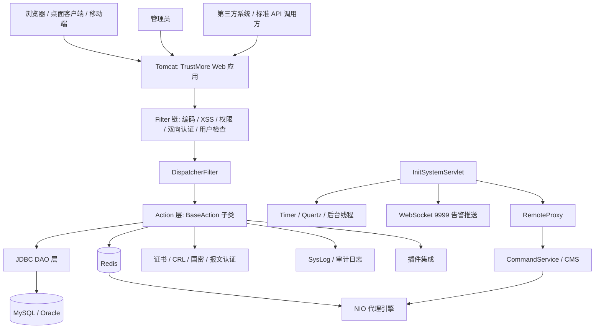
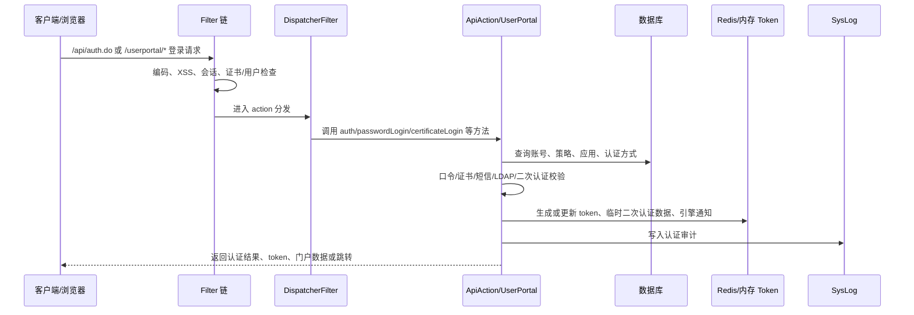
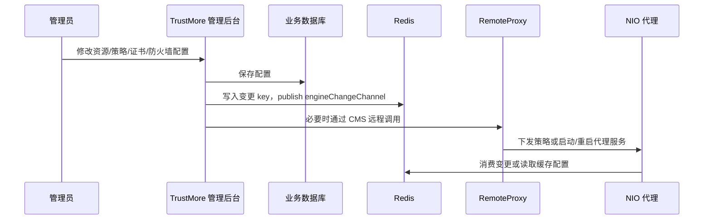
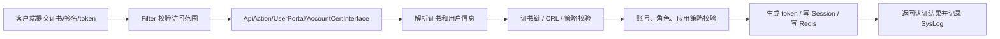
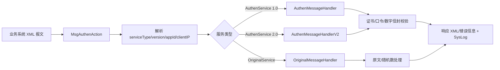
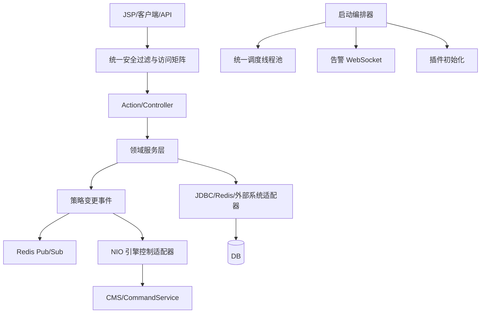

# TrustMore 架构设计文档

> 生成日期：2026-05-11  
> 分析范围：`TrustMore/` 源码、`WebContent/WEB-INF/web.xml`、`resources/` 配置、Ant 构建脚本及已有项目说明文档  
> 分析方式：静态代码分析  

## 1. 项目定位

`TrustMore` 是一个传统 Java Web 应用，部署形态为 Tomcat 下的 ROOT Web 应用，主要承担统一认证、访问控制管理、证书管理、审计日志、用户门户、管理后台、第三方插件集成以及与 NIO 代理引擎的控制面协作。

从代码结构和入口配置看，系统不是一个单纯的门户站点，而是“认证管理面 + 代理引擎控制面 + 对外认证 API”的组合：

- 面向浏览器/客户端：提供登录、证书认证、口令认证、短信认证、终端注册、用户门户、客户端下载等能力。
- 面向管理员：提供账号、组织、资源、策略、审计、证书、系统配置、插件、运行维护等管理能力。
- 面向代理引擎：通过 `RemoteProxy`、Redis、CMS/CommandService 等机制下发策略、同步状态、启动或控制 NIO 代理。
- 面向外部系统：提供标准 API、报文认证、OAuth、SAML、OpenID、HR/第三方机构同步等集成能力。

## 2. 技术栈概览

| 类别 | 技术/组件 | 说明 |
| --- | --- | --- |
| Web 容器 | Tomcat | `.classpath` 和 `build.properties` 指向 Tomcat 运行与部署目录 |
| Web 规范 | Servlet 2.4、JSP | `web.xml` 使用 Servlet 2.4 schema，页面集中在 `WebContent` |
| MVC/分发 | `com.shengruan.framework.dispatcher.DispatcherFilter` | 通过多个 action XML 将 `.do`、`.action` 路由到 Java Action 方法 |
| 构建 | Ant | `build.xml` 编译 `src`、复制 `resources` 与 action XML，部署到 `/tsg/web/ROOT` |
| 数据库 | MySQL、Oracle | `dbconfig.properties` 配置主业务库、日志库、Oracle 外部库 |
| 缓存/消息 | Redis/Jedis | 用于 token、二次认证临时数据、策略/引擎变更通知、网盘消息等 |
| 定时任务 | Quartz、`java.util.Timer` | Quartz 由 `QuartzInitializerServlet` 启动；大量运行期任务由 `InitSystemServlet` 创建 |
| 日志审计 | Log4j、SysLogClient/SysLogServer | 业务日志、接口日志、系统审计与远程 syslog |
| 证书/密码 | X.509、SM2/SM3、RSA、PKCS#7、CRL | 认证、证书签发/撤销/验证、国密相关能力 |
| 单点登录 | OAuth、SAML、OpenID、NTLM/Jespa/jCIFS | 多协议认证与第三方身份集成 |
| 外部控制 | CommandService/CMS、Shell | 控制 NIO 代理、系统服务、watchdog、iptables、防火墙等 |

## 3. 总体架构



核心设计特点：

- 请求入口高度依赖 Servlet Filter，业务入口统一交给 `DispatcherFilter`。
- Action 类多数继承 `BaseAction`，在 Action 内直接组织鉴权、参数解析、DAO 调用、响应输出和审计。
- DAO 层以 `*Jdbc` 类为主，继承外部框架 `com.shengruan.framework.jdbc.BaseJdbc`。
- 启动初始化集中在 `InitSystemServlet.init()`，该类负责日志、license、系统参数、定时任务、WebSocket、插件、NIO 引擎控制等大量全局资源。
- 代理数据面不在 `TrustMore` 内直接运行，`TrustMore` 主要通过 Redis 和 CMS/CommandService 控制 NIO 引擎。

## 4. 目录与模块划分

```text
TrustMore/
├── src/                         Java 源码
│   ├── cn/com/tsg/admin/         管理后台：账号、资源、策略、审计、系统配置、维护
│   ├── cn/com/tsg/user/          用户登录、门户、API、终端、应用访问
│   ├── cn/com/tsg/standard/      标准用户门户接口、证书接口、客户端交互接口
│   ├── cn/com/tsg/messageauth/   报文认证、随机数、数字信封、认证报文解析
│   ├── cn/com/tsg/cert/          证书验证、证书规则、证书插件接口
│   ├── cn/com/tsg/crl/           CRL 查询、撤销状态、缓存策略
│   ├── cn/com/tsg/plugin/        项目/客户插件：BJCA、CoreMail、FTP、四川、达州等
│   ├── cn/com/tsg/util/          公共工具、Filter、RemoteProxy、Redis 辅助、WebSocket
│   ├── jcifs/、jespa/             NTLM/SMB/Windows 集成相关三方或改造源码
│   └── com/cmcc、com/tebie 等     外部系统接口、Demo、WebService 生成代码
├── WebContent/                  Web 根目录
│   ├── WEB-INF/web.xml           Servlet、Filter、Listener、Dispatcher 配置
│   ├── WEB-INF/lib/              项目依赖 jar
│   ├── admin/                    管理后台 JSP
│   ├── user/、portal6.2/          用户门户 JSP
│   ├── api/                      API 示例与页面资源
│   ├── update/                   客户端安装包、驱动、升级文件
│   └── error/、custom/            错误页与定制页
├── resources/                   运行配置：数据库、日志、Quartz、证书、业务配置
├── build.xml                    Ant 构建脚本
└── build.properties             构建与部署参数
```

按源码数量看，`cn.com.tsg.admin` 是最大模块，说明管理后台和策略配置是系统主体；`cn.com.tsg.util` 承载大量横切能力；`plugin`、`messageauth`、`user`、`cert`、`crl` 是认证与集成面的核心。

## 5. Web 入口设计

### 5.1 启动入口

`web.xml` 中配置了两个主要启动 Servlet：

- `org.quartz.ee.servlet.QuartzInitializerServlet`：启动 Quartz，读取 `/quartz.properties`，再通过 `quartz_job.xml` 初始化任务。
- `cn.com.tsg.servlet.InitSystemServlet`：系统总初始化入口，`load-on-startup=1`。

`InitSystemServlet` 的职责很重，包含：

- 初始化 Log4j、SysLog 数据库连接、日志模板和日志服务。
- 读取 license、系统配置、插件配置、CRL 策略、权限 URL 列表、IP 缓存。
- 启动终端检查、系统状态、Redis 检测、SPA 清理、CRL 同步、策略备份、FTP 备份、NTP、证书链、BOC 同步等定时任务。
- 初始化 WebSocket 告警推送服务，监听 `0.0.0.0:9999`。
- 执行引擎升级脚本、启动或控制 NIO 代理相关进程。
- 启动服务中心 Redis 订阅线程等后台任务。

### 5.2 请求过滤器链

主要 Filter 如下：

| Filter | 主要作用 | 典型范围 |
| --- | --- | --- |
| `SetCharacterEncodingFilter` | 统一 UTF-8 编码 | `*.do`、`*.action`、`*.jsp` |
| `XssFilter` | 请求参数 XSS 包装与过滤 | `*.do`、`*.jsp` |
| `CheckAdminFilter` | 管理员访问控制 | `/admin/*`、关键管理接口 |
| `CheckActionFilter` | action 级权限检查 | `*.action` |
| `CheckCertApiFilter` | 证书验证 API 访问检查 | `/api/verificationCert*.do` |
| `CheckTwoWayUserFilter` | 双向认证用户检查 | `*.do`、`*.jsp`、`*.action`、`/api/cert_auth` |
| `CheckMobileUserFilter` | 移动端用户检查 | `/mobile/user/*` |
| `NoPassFilter` | 定制页面免登录路径 | `/custom/*` |
| `CheckUserFilter` | 用户会话、token、二次认证检查 | `/user/*`、`/userportal/*`、`/userverify/*` |
| `CheckQueryFilter` | 查询接口权限检查 | `/userverify/*` |
| `CheckMaintenanceFilter` | 维护页面访问控制 | `/admin/maintenance.do` |
| `DispatcherFilter` | 核心业务分发 | `*.do`、`*.action`、`/MessageService` |

### 5.3 Action 路由机制

系统使用 `DispatcherFilter` 读取 action XML，例如：

- `cn/com/tsg/user/action/user-action.xml`
- `cn/com/tsg/admin/action/account/account-action.xml`
- `cn/com/tsg/admin/action/resource/resource-action.xml`
- `cn/com/tsg/admin/action/audit/audit-action.xml`
- `cn/com/tsg/standard/action/Standard-Portal.xml`
- `cn/com/tsg/plugin/action/plugin-action.xml`
- `cn/com/tsg/zerotrust/action/zeroTrustControl.xml`

静态统计显示，项目中 action 配置约 1000+ 条。典型配置形式：

```xml
<action path="/api/auth.do"
        class="cn.com.tsg.user.action.ApiAction"
        method="auth"/>
```

也就是说，请求路径先由 Filter 链处理，再由 `DispatcherFilter` 根据 XML 找到 Action 类与方法，最后通过反射或框架机制执行。

## 6. 核心业务模块设计

### 6.1 用户认证与用户门户

主要包：

- `cn.com.tsg.user.action`
- `cn.com.tsg.user.jdbc`
- `cn.com.tsg.user.model`
- `cn.com.tsg.standard.action`

核心类：

- `ApiAction`：对外认证 API 的主要入口，聚合账号、应用、策略、LDAP、证书、Redis、短信、二次认证、token 等能力。
- `UserAction`：Web 登录、客户端登录、证书登录、用户注册、修改信息等。
- `PortalAction`：用户门户、应用打开、HTML 应用登录等。
- `UserPortal`：标准门户接口，提供版本、登录、组织用户查询、终端、证书、应用、网盘、客户端状态等能力。
- `BaseAction`：公共认证、token 解密、session 读取、JDBC 获取、syslog 发送等基础方法。

典型认证流程：



### 6.2 管理后台

主要包：

- `cn.com.tsg.admin.action`
- `cn.com.tsg.admin.jdbc`
- `cn.com.tsg.admin.model`
- `cn.com.tsg.admin.pojo`

管理能力按子包拆分：

- `account`：账号、部门、主从账号、账号策略、证书状态。
- `resource`：BS/CS/NC/NVR 应用、代理资源、账号映射、客户端状态。
- `audit`：审计日志、报表、IP 字典、消息审计配置。
- `auth` / `authmethod`：认证策略、认证方式、角色过滤、机构认证。
- `certmanager`：设备证书、可信证书、吊销证书、证书链。
- `firewall` / `ipsec` / `iptables`：网络访问、防火墙、NAT、包过滤、IPSec。
- `sysconf`：系统参数、HAProxy、DNS、网关路由、恢复、同步数据库、服务中心。
- `monitor` / `operation` / `sysoperation`：系统监控、任务、运维、维护模式。

设计风格是“一个业务域对应 Action + Jdbc + Model”，但 Action 往往直接承担服务层职责，项目中没有明显独立的 Service 层边界。

### 6.3 证书、CRL 与国密能力

主要包：

- `cn.com.tsg.cert`
- `cn.com.tsg.cert.verify`
- `cn.com.tsg.crl`
- `cn.com.tsg.gm`
- `cn.com.tsg.messageauth.certauth`

职责：

- 证书解析、有效期检查、证书链、根证书缓存。
- 证书签发、下载、吊销、认证接口。
- CRL 状态查询、策略缓存、定时刷新。
- SM2/SM3、RSA、PKCS#7、数字信封等认证报文处理。

证书有效性接口的开关由 `InitCertVerificationUtils` 读取 `/tsg/conf/syncStrategy.config`，并缓存到静态变量 `certVerificationApiStatus`。

### 6.4 报文认证

主要包：

- `cn.com.tsg.messageauth.action`
- `cn.com.tsg.messageauth.service`
- `cn.com.tsg.messageauth.message`
- `cn.com.tsg.messageauth.utils`

核心入口：

- `/Authen/MessageService.action`
- `/MessageService`
- `/Authen/getRandom.action`
- `/GetEncryptionCert.action`

`MsgAuthenAction.messageAuth()` 会读取请求 XML，解析 `serviceType` 与 `version`，再分派到：

- `AuthenMessageHandler`：统一认证 1.0。
- `AuthenMessageHandlerV2`：统一认证 2.0。
- `OriginalMessageHandler`：原文/随机数服务。

该模块与应用表、证书、数字信封、syslog 强耦合，是标准化报文认证接口的核心。

### 6.5 插件体系

主要包：

- `cn.com.tsg.plugin`

插件目录覆盖多个客户或第三方场景：

- `bjca`：北京 CA。
- `captcha`：验证码。
- `coremail`：CoreMail 邮件集成。
- `ftp`：FTP 文件/转换任务。
- `organismauth`：机构认证，含灵信二维码认证等。
- `sichuanGS`、`dazhou`、`nationalSICenter`、`sicgovcn` 等客户定制。
- `trustMonitoring`：信任监控。

插件并不是独立插件框架加载的 JAR，而是源码包级模块，通过配置、启动初始化和 action XML 被主应用直接引用。

### 6.6 NIO 代理控制协作

`TrustMore` 与 NIO 代理引擎之间有两类协作：

1. Redis 协作：`JedisConn` 向 `engineChangeChannel` 等通道 publish 变更消息，并写入 `token_*`、策略、服务信息等 key。
2. CMS/CommandService 协作：`RemoteProxy` 通过 `CommanCaller`、CMS 端口、远程对象调用和 shell 脚本启动/停止/配置 NIO 引擎。

设计上，`TrustMore` 是控制面和认证面，NIO 项目是数据面代理引擎。二者通过数据库、Redis、CMS 远程调用和配置脚本协同。

## 7. 数据与状态设计

### 7.1 数据库

`resources/dbconfig.properties` 配置了多个数据源：

- `jdbc` / `jdbc-sub`：主业务库，默认指向 MySQL `TrustMore`。
- `jdbc-log`：审计日志库，默认指向 MySQL `SysLog`。
- `jdbc-oracle` / `jdbc-oracleSub1` / `jdbc-oracleSub2`：外部 Oracle 数据源，用于客户侧 HR/同步类集成。

注意：配置文件中存在加密后的账号密码和固定连接信息，架构上应视为敏感配置，部署时需要纳入密钥与配置管理。

### 7.2 Redis

`cn.com.tsg.admin.redis.jdbc.JedisConn` 和 `JedisUtil` 使用本地 Redis `127.0.0.1:6379`，密码通过 AES 解密得到。

主要用途：

- token 与在线态：如 `token_<tokenId>`。
- 二次认证临时数据：`SecondFactorAuthUtils` 写入短 TTL 的加密临时值。
- 引擎变更通知：`engineChangeChannel`。
- 服务中心订阅：`service_info`。
- 网盘/客户端消息：如 `netDiskChat`。
- 策略和服务配置缓存。

### 7.3 Session 与内存状态

系统大量使用：

- `HttpSession`：保存 `account`、二次认证 token、登录态等。
- `Constants` 静态字段：全局配置、license、缓存、运行状态。
- `CloudTokenManagement`：云盘远程登录场景下的内存 token 管理。
- 各类静态缓存：CRL、权限 URL、IP 列表、证书链、插件配置等。

这类设计性能直接，但对热部署、集群、多节点一致性和资源释放要求较高。

## 8. 定时任务与后台线程

系统后台任务来源较多：

- Quartz：`quartz.properties` + `quartz_job.xml`，用于磁盘、内存、CPU、基础信息、客户插件同步等任务。
- `InitSystemServlet` 内部 `Timer`：
  - `CheckDeviceTimer`
  - `SystemTask`
  - `CheckRedisTimer`
  - `CheckSpaTimer`
  - `CrlStrategyTask`
  - `CheckBOCTimer`
  - `CheckAccountPolicyTimer`
  - `RecoveryTimer`
  - `RecoveryUpFTPTimer`
  - `NtpTimer`
- 裸线程：
  - `CheckConvertThread`
  - 默认代理/非代理引擎启动线程
  - Redis 订阅处理线程
  - 插件监听线程
- WebSocket：
  - `cn.com.tsg.util.websocket.WebsocketServer` 监听 `9999`，用于告警推送。

架构建议：这些资源最好有统一生命周期管理，至少在 `Servlet.destroy()` 中停止 Timer、线程、WebSocket、订阅连接和端口监听，避免热部署或重启时残留。

## 9. 典型链路设计

### 9.1 管理后台配置资源并下发代理



### 9.2 证书认证



### 9.3 报文认证



## 10. 部署与构建设计

构建流程由 Ant 驱动：

1. `clean`：清理 build、部署目录和 WAR。
2. `prepare`：复制 `WebContent`。
3. `compile`：编译 `src` 到 `build/WEB-INF/classes`，复制 `resources`，并复制源码中的 XML/properties。
4. `deploy`：复制构建结果到 `/tsg/web/ROOT`。
5. `deploywar`：可打包 WAR。

部署假设：

- 应用作为 Tomcat ROOT 部署。
- 外部目录 `/tsg/conf`、`/tsg/bin`、`/tsg/apps/tomcat`、`/tsg/web/ROOT` 存在。
- 本地 Redis、数据库、SysLog、CMS/CommandService、NIO 引擎脚本和 license 环境已准备。
- 客户端安装包和驱动直接随 WebContent 发布。

## 11. 架构风险与改进建议

| 风险点 | 现状 | 建议 |
| --- | --- | --- |
| 启动类职责过重 | `InitSystemServlet` 同时负责初始化、定时任务、脚本、WebSocket、代理启动、插件、日志 | 拆分为独立启动服务，建立统一生命周期与失败隔离 |
| 后台线程缺少统一管理 | 大量 `new Timer()`、`new Thread()`，缺少集中 shutdown | 引入 `ScheduledExecutorService` 与命名线程池，并在 `destroy()` 中关闭 |
| Action 过胖 | `ApiAction`、`UserPortal` 等类聚合大量业务和 DAO | 引入服务层，按认证、证书、策略、门户拆分 |
| 静态状态多 | `Constants`、静态缓存、单例 Redis 连接承载大量运行状态 | 明确缓存边界，引入刷新机制和集群一致性设计 |
| 配置敏感信息分散 | 数据库、Redis、证书路径、脚本路径散落 properties 和源码 | 配置外置化，敏感信息交给密钥管理或环境变量 |
| Redis 连接封装较旧 | 手动 `returnResource`、单例 pool、多处直接 new Jedis | 升级 JedisPool 使用方式，统一 Redis 客户端和连接关闭策略 |
| 控制面与系统脚本耦合强 | 直接执行 `/tsg/bin/*.sh`，依赖固定路径 | 抽象引擎控制接口，补充超时、重试、幂等和审计 |
| Filter 顺序复杂 | 多个鉴权 Filter 叠加，路径排除规则分散 | 梳理访问矩阵，形成统一安全策略表和测试用例 |
| XML 路由规模大 | 1000+ action 配置，重复路径和维护成本高 | 增加路由检查脚本，识别重复 path、失效 class/method |

## 12. 目标架构建议

在不推翻现有系统的前提下，推荐按以下方向演进：



优先级建议：

1. 先补齐启动/销毁生命周期，降低运行风险。
2. 再从 `ApiAction`、`UserPortal`、`InitSystemServlet` 抽取服务层。
3. 建立 action XML 的自动校验，避免重复路径、方法不存在、权限遗漏。
4. 将 Redis、SysLog、RemoteProxy、证书验证封装成清晰的基础设施适配器。
5. 对认证主链路、证书主链路、策略下发主链路补集成测试。

## 13. 关键源码索引

| 文件 | 说明 |
| --- | --- |
| `TrustMore/WebContent/WEB-INF/web.xml` | Web 应用入口、Filter 链、DispatcherFilter、Listener、错误页、安全约束 |
| `TrustMore/src/cn/com/tsg/servlet/InitSystemServlet.java` | 系统启动初始化总入口 |
| `TrustMore/src/cn/com/tsg/util/BaseAction.java` | Action 公共基类，含 token、session、syslog、JDBC 辅助 |
| `TrustMore/src/cn/com/tsg/user/action/ApiAction.java` | 对外认证 API 主入口 |
| `TrustMore/src/cn/com/tsg/standard/action/UserPortal.java` | 标准用户门户接口主类 |
| `TrustMore/src/cn/com/tsg/messageauth/action/MsgAuthenAction.java` | 报文认证入口 |
| `TrustMore/src/cn/com/tsg/admin/redis/jdbc/JedisConn.java` | Redis 连接、publish、set/get 封装 |
| `TrustMore/src/cn/com/tsg/util/RemoteProxy.java` | 与代理引擎/CMS 通信的主要控制类 |
| `TrustMore/resources/dbconfig.properties` | 数据源配置 |
| `TrustMore/resources/quartz.properties`、`TrustMore/resources/quartz_job.xml` | Quartz 调度配置 |
| `TrustMore/build.xml`、`TrustMore/build.properties` | Ant 构建与部署配置 |

