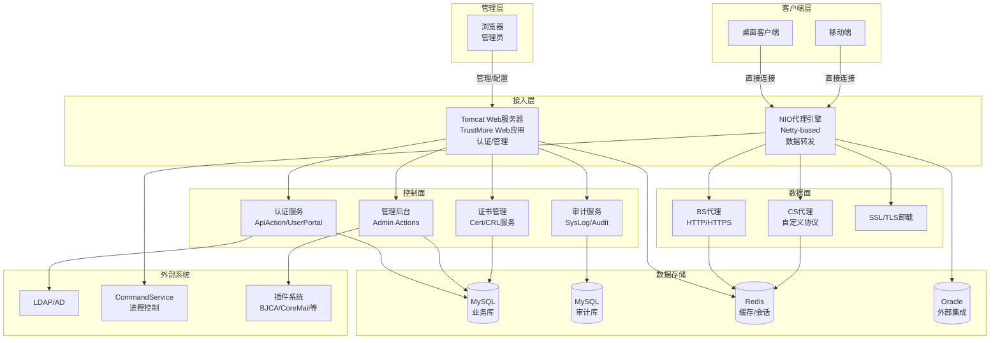
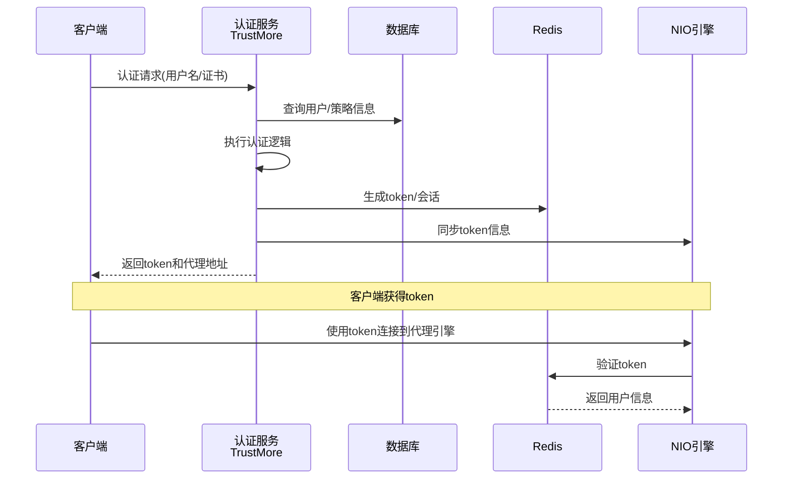
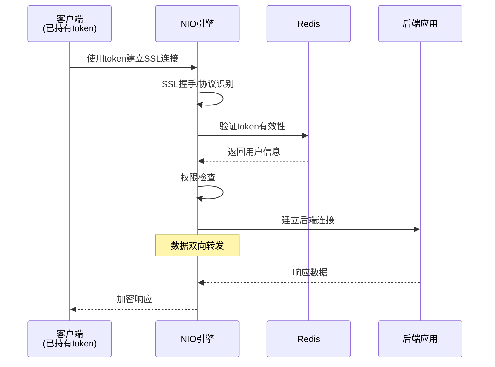
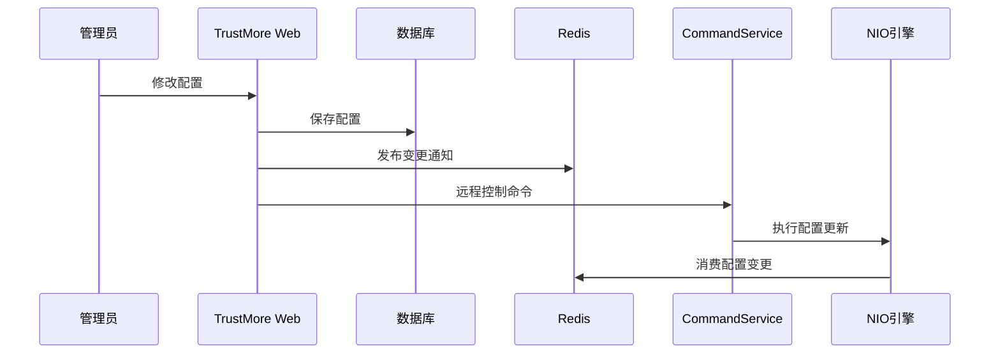

# TrustMore 项目架构设计文档

> **生成日期**: 2026-05-11  
> **分析范围**: TrustMore/ 源码、NIO/ 源码、相关文档和配置文件  
> **分析方式**: 静态代码分析、文档整合  
> **文档生成**: GitHub Copilot

## 1. 项目概述

TrustMore 是一个企业级的统一认证与访问控制平台，结合了传统Java Web应用和现代NIO代理引擎。系统主要提供：

- **认证管理**: 支持多种认证方式（证书、口令、短信、LDAP、OAuth、SAML、OpenID等）
- **访问控制**: 基于角色的权限管理、资源策略配置
- **代理服务**: 高性能SSL VPN代理引擎，支持HTTP/HTTPS反向代理和自定义协议转发
- **审计监控**: 完整的系统审计、日志记录和实时监控
- **第三方集成**: 支持多种插件和外部系统集成

系统采用控制面（TrustMore Web应用）+ 数据面（NIO代理引擎）的分布式架构，通过Redis、数据库和CMS进行协作。

## 2. 总体架构



## 3. 技术栈

| 组件 | 技术选型 | 版本/说明 |
|------|----------|-----------|
| **Web容器** | Tomcat | ROOT应用部署 |
| **Web框架** | Servlet/JSP | Servlet 2.4规范 |
| **MVC分发** | 自定义DispatcherFilter | XML配置路由 |
| **代理引擎** | Netty | 4.1.11.Final，高性能NIO |
| **数据库** | MySQL/Oracle | 主业务库、审计库、外部集成 |
| **缓存/消息** | Redis/Jedis | 会话、配置、通知 |
| **定时任务** | Quartz/Timer | 后台任务调度 |
| **日志审计** | Log4j/SysLog | 业务日志、系统审计 |
| **证书密码** | X.509/SM2/SM3/RSA | 国密算法支持 |
| **单点登录** | OAuth/SAML/OpenID | 多协议认证集成 |
| **构建工具** | Ant | 多模块构建 |

## 4. 核心模块设计

### 4.1 TrustMore Web应用模块

#### 用户认证与门户 (cn.com.tsg.user / cn.com.tsg.standard)
- **ApiAction**: 对外认证API主入口，支持多种认证方式
- **UserPortal**: 标准用户门户接口，提供应用访问、证书管理等
- **PortalAction**: 用户门户页面逻辑

#### 管理后台 (cn.com.tsg.admin)
- **account**: 账号、部门、策略管理
- **resource**: 应用资源、代理配置管理
- **audit**: 审计日志、报表生成
- **certmanager**: 证书生命周期管理
- **sysconf**: 系统参数、监控配置

#### 证书与安全 (cn.com.tsg.cert / cn.com.tsg.crl)
- **证书验证**: 证书链校验、CRL状态查询
- **国密支持**: SM2/SM3算法实现
- **报文认证**: PKCS#7、数字信封处理

#### 插件系统 (cn.com.tsg.plugin)
- **bjca**: 北京CA集成
- **coremail**: 邮件系统集成
- **ftp**: 文件传输服务
- **客户定制**: 四川、达州等专用插件

### 4.2 NIO代理引擎模块

#### 核心引擎 (proxy-core)
- **ProxyEngine**: 状态机驱动的代理引擎
- **EngineStatus**: 引擎状态管理
- **IIoModel**: IO模型接口

#### 协议处理
- **proxy-bs**: HTTP/HTTPS反向代理
- **proxy-cs**: 自定义协议转发(TCP/UDP)

#### 公共组件
- **proxy-api**: 公共接口定义
- **proxy-interface**: 服务接口规范
- **util**: 工具类库

## 5. 数据流设计

### 5.1 用户认证流程



### 5.2 代理转发流程



### 5.3 配置下发流程



## 6. 部署架构

### 6.1 部署拓扑

```
┌──────────────────────────────────────────────────────────────────┐
│                      管理员 (浏览器访问)                          │
│                           │                                      │
│                    ┌──────▼──────┐                               │
│                    │   Nginx/    │ (管理接入)                    │
│                    │  HAProxy    │                               │
│                    └──────┬──────┘                               │
└────────────────────────────┼─────────────────────────────────────┘
                             │
┌────────────────────────────▼─────────────────────────────────────┐
│                    Web应用层 (管理/认证)                          │
│  ┌──────────────┐  ┌──────────────┐  ┌──────────────┐           │
│  │  TrustMore   │  │  TrustMore   │  │  TrustMore   │           │
│  │   Tomcat     │  │   Tomcat     │  │   Tomcat     │           │
│  │ (认证/管理)   │  │ (认证/管理)   │  │ (认证/管理)   │           │
│  └──────────────┘  └──────────────┘  └──────────────┘           │
└─────────────────────────────────────────────────────────────────┘
         │                                      │
         └──────────────┬───────────────────────┘
                        │ (认证请求/配置同步)
                        │
┌───────────────────────▼──────────────────────────────────────────┐
│           代理引擎层 (客户端直接连接)                             │
│  ┌──────────────┐  ┌──────────────┐  ┌──────────────┐           │
│  │    NIO       │  │    NIO       │  │    NIO       │           │
│  │   Engine     │  │   Engine     │  │   Engine     │           │
│  └──────────────┘  └──────────────┘  └──────────────┘           │
└────────┬──────────────────────────────────────────┬──────────────┘
         │                                          │
    ┌────▼────────┐                        ┌────────▼─────┐
    │  客户端连接  │                        │  后端应用服务 │
    │(桌面/移动)  │                        │  (数据源)     │
    └─────────────┘                        └───────────────┘
         │
         │ (配置同步/会话)
         │
┌────────▼──────────────────────────────────────────────────────────┐
│                   数据存储层                                       │
│  ┌──────────────┐  ┌──────────────┐  ┌──────────────┐            │
│  │   MySQL      │  │   Redis      │  │   Oracle     │            │
│  │  主库/从库    │  │  集群        │  │  外部集成    │            │
│  └──────────────┘  └──────────────┘  └──────────────┘            │
└─────────────────────────────────────────────────────────────────┘
```

### 6.2 高可用设计

- **Web应用层**: 多Tomcat实例 + Session共享(Redis)
- **代理引擎层**: 多NIO实例 + 配置同步
- **数据层**: MySQL主从 + Redis集群
- **监控**: WebSocket告警推送 + SysLog集中收集

## 7. 安全架构

### 7.1 访问控制矩阵

| 访问类型 | 认证方式 | 授权检查 | 审计记录 |
|----------|----------|----------|----------|
| 管理后台 | 用户名/密码 + 证书 (浏览器) | 角色权限 | 全量审计 |
| 用户门户 | 多因子认证 (浏览器/客户端) | 应用权限 | 关键操作 |
| API调用 | Token/证书 (TrustMore) | 接口权限 | 调用日志 |
| 代理访问 | Token验证 (NIO引擎) | 资源策略 | 访问日志 |

### 7.2 安全组件

- **传输安全**: SSL/TLS双向认证
- **数据安全**: 证书验证、数字签名
- **访问控制**: 基于角色的权限管理
- **审计监控**: 实时日志记录和告警

## 8. 性能与扩展性

### 8.1 性能指标

- **并发处理**: NIO引擎基于Netty，支持高并发连接
- **SSL卸载**: 硬件/软件SSL加速
- **缓存策略**: Redis缓存热点数据
- **连接池**: 数据库和Redis连接池管理

### 8.2 扩展点

- **插件架构**: 支持业务逻辑扩展
- **协议扩展**: 自定义协议处理器
- **存储扩展**: 支持多种数据库后端
- **监控扩展**: 可插拔监控指标收集

## 9. 运维与监控

### 9.1 监控指标

- **系统指标**: CPU、内存、磁盘、网络
- **应用指标**: 请求响应时间、错误率、吞吐量
- **业务指标**: 认证成功率、代理转发量
- **安全指标**: 异常访问、审计事件

### 9.2 日志体系

- **业务日志**: 用户操作、系统事件
- **审计日志**: 安全相关操作记录
- **系统日志**: 应用运行状态、错误信息
- **性能日志**: 请求耗时、资源使用

## 10. 风险评估与改进建议

### 10.1 架构风险

| 风险等级 | 风险点 | 影响 | 建议措施 |
|----------|--------|------|----------|
| 高 | InitSystemServlet职责过重 | 系统启动失败风险 | 拆分启动逻辑，增加错误处理 |
| 中 | 静态状态管理混乱 | 内存泄漏、状态不一致 | 引入统一缓存管理框架 |
| 中 | Action类过于庞大 | 维护困难、测试复杂 | 抽取服务层，遵循单一职责 |
| 低 | 配置信息安全 | 敏感信息泄露 | 配置加密和外部化管理 |

### 10.2 技术债务

- **代码结构**: 缺少服务层抽象
- **测试覆盖**: 单元测试和集成测试不足
- **文档更新**: 架构文档与代码实现偏差
- **依赖管理**: 第三方库版本管理不规范

### 10.3 演进建议

1. **短期 (3-6个月)**:
   - 重构InitSystemServlet，拆分启动职责
   - 引入统一缓存管理
   - 完善错误处理和日志记录

2. **中期 (6-12个月)**:
   - 抽取服务层，优化Action设计
   - 建立自动化测试体系
   - 升级核心依赖版本

3. **长期 (1-2年)**:
   - 微服务化拆分核心功能
   - 容器化部署和编排
   - 云原生架构转型

## 11. 总结

TrustMore项目是一个功能完整的企业级认证与代理平台，采用了控制面+数据面的分布式架构设计。通过TrustMore Web应用提供统一的管理和认证入口，结合NIO代理引擎实现高性能的数据转发和服务代理。系统在安全、扩展性和运维方面具有良好的基础，但在代码结构和测试覆盖方面存在改进空间。

未来发展方向应重点关注架构现代化、测试完善和DevOps能力的提升，以适应云计算和微服务的发展趋势。</content>
<parameter name="filePath">/home/tiandb/Dev/SVN/6.4.2/TrustMore架构设计copilot.md