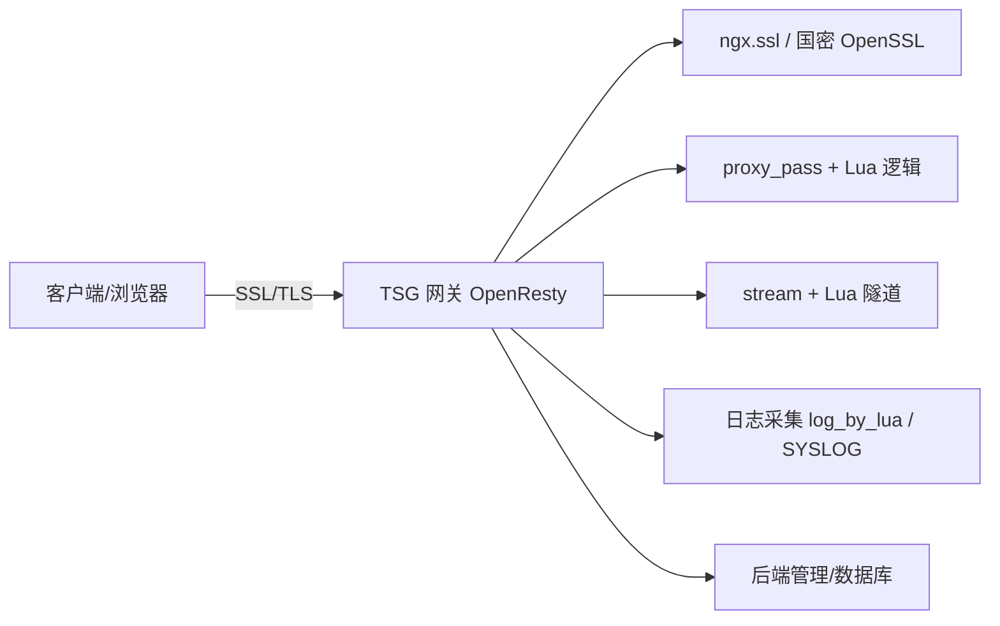
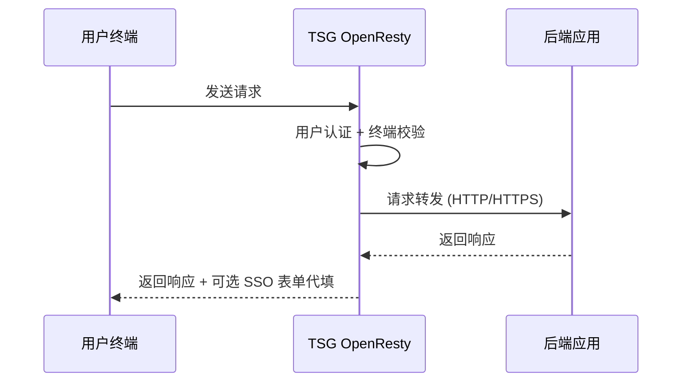
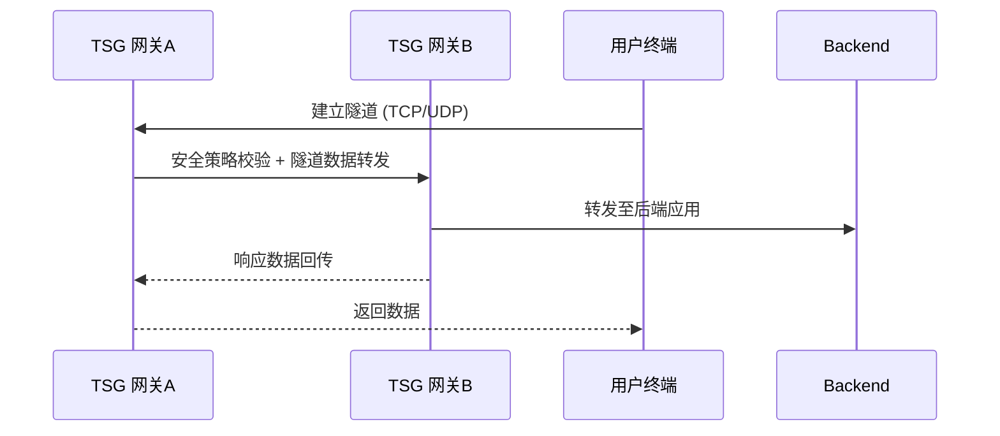

# TSG 7.6 架构迁移概要设计（Java → OpenResty）

## 1. 文档信息

| 项目 | 内容 |
|------|------|
| 文档名称 | TSG 7.6 架构迁移概要设计 |
| 所属产品 | TrustMore 边界安全网关（TSG 7.6） |
| 版本 | 1.0 |
| 创建日期 | 2026-05-07 |
| 编制 | 田东波（研发部） |
| 审核 | 产品部 / 测试部 |
| 类型 | 概要设计文档 |

---

## 2. 设计目标

- 将对外服务引擎从 **Java** 平台迁移到 **OpenResty**  
- 保证功能等价、行为兼容、部署兼容  
- 提升性能（高并发、低延迟、低资源占用）  
- 模块化设计，便于后续维护和升级

---

## 3. 系统总体架构

**说明：** OpenResty 负责 HTTP(S) 处理、SSL/TLS 终结、反向代理、NC 隧道、Lua 扩展业务逻辑；后端管理、数据库逻辑保持不变；日志可转发至 SYSLOG。

---

## 4. 核心模块与技术方案

| 模块 | 功能概要 | 技术方案 |
|------|---------|---------|
| 链路安全 | SSL/TLS + 国密加密 | ngx.ssl + 国密 OpenSSL / Tongsuo |
| 用户认证 | 证书、口令、双因子 | access_by_lua + ssl_certificate_by_lua |
| 权限管理 | RBAC、动态角色、策略 | Lua 规则匹配 + 后端策略，端口级控制 OpenResty 原生 |
| 应用代理 | B/S、C/S 应用 | proxy_pass + stream 模块 + Lua 路由/URL重写 |
| NC 模式 | 网状/星型隧道 | stream 模块 + Lua |
| SSO | 表单代填、证书透传 | body_filter_by_lua + header_filter_by_lua |
| 统一门户 | 授权应用列表、跳转 | 静态页面 + Lua API |
| 终端安全 | 安全基线、绑定、零痕迹 | Lua 策略验证 / 后端 API |
| 高可用 | 双机热备、负载均衡 | OpenResty upstream + shared dict |
| 日志审计 | 用户/系统/管理日志 | log_by_lua + SYSLOG |
| 监控运维 | 在线用户、连接数、SNMP | OpenResty + shared dict + 后端 API |

---

## 5. 核心流程图

### 5.1 反向代理模式

### 5.2 NC 模式隧道

---

## 6. 性能目标（SG-5300示例）

| 指标 | 目标值 |
|------|--------|
| 国密最大新建连接数 | ≥4,500 次/秒 |
| 国密 SSL 事务速率 | ≥8,000 次/秒 |
| 国密最大并发连接数 | ≥50,000 |
| 国密加密吞吐量 | ≥1,200 Mbps |
| SSL 握手 P99 延迟 | ≤ 70% Java |
| 接入用户数 | ≥15,000 |

---

## 7. 风险点与应对

| 风险 | 等级 | 应对措施 |
|------|------|----------|
| 国密 OpenSSL 与 OpenResty 集成 | 🔴 高 | Phase 0 PoC 验证 |
| SSO 表单代填复杂 | 🟡 中 | 分阶段迁移，优先主流方案 |
| 双机热备状态同步 | 🟡 中 | shared dict + 后端同步 |
| Lua 第三方库不成熟 | 🟡 中 | 后端 API 转发备用 |
| 性能未达预期 | 🟢 低 | 保留 Java 版本回退 |

---

## 8. 阶段实施概要

| 阶段 | 内容 | 产出 | 预估周期 |
|------|------|------|----------|
| Phase 0 | 国密 PoC 验证 | 可行性报告 | 1 周 |
| Phase 1 | 核心流量迁移 | SSL/TLS + 反向代理 + 认证 + RBAC | 4-6 周 |
| Phase 2 | 高级功能迁移 | SSO + NC + 双机热备 | 3-4 周 |
| Phase 3 | 监控审计适配 | 日志 + SNMP + SysLog | 2 周 |
| Phase 4 | 全量功能 + 性能测试 | 测试报告 | 2-3 周 |
| Phase 5 | 兼容性验证 + 试运行 | 验收报告 | 1-2 周 |

**优先级**：Phase0 > Phase1 > Phase4 > Phase2 > Phase3 > Phase5

---

## 9. 一句话结论

> TSG 7.6 架构迁移本质为“换引擎不换功能”，概要设计提供模块划分、核心流程、技术实现点，指导研发、测试和运维团队执行迁移。

